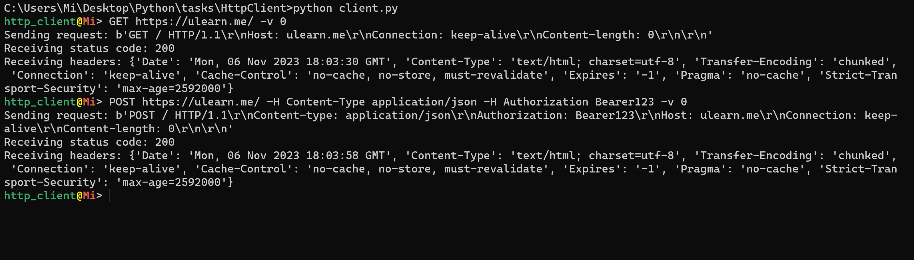

# HTTP client

This program is a command-line HTTP client that allows you to send HTTP
requests and receive responses from servers to interact with web services and
retrieve data. (cookies supported!)

## Usage

```
[METHOD] [URL] [-H KEY VALUE] [-i INPUT] [-o OUTPUT] [-t TIMEOUT] [-v VERBOSE]
```

### Arguments

- `METHOD`: Describes one of the available HTTP request methods.
- `URL`: A string that identifies the location of a resource on the internet using HTTP or HTTP(S) protocol
- `-H`, `--header`: A key-value pair that provides additional information
  related to an HTTP request. Can be used multiple times.
- `-i`, `--input`: The path of the HTTP request content.
- `-o`, `--output`: The file path where the HTTP response will be saved.
- `-t`, `--timeout`: The timeout for the HTTP response. Default is 5 seconds.
- `-v`, `--verbose`: Informative and detailed response level. Set verbose value to 0 to get less information. Default is 1.

## Getting Started

1. Install the required dependencies:

```
pip install -r requirements.txt
```

2. Run the program:

```
python client.py
```

3. Follow the prompts and provide the required information for the HTTP
   request.

## Examples

- Sending a GET request:

```
GET https://ulearn.me/ -v 0
```

- Sending a POST request with headers:

```
POST https://ulearn.me/ -H Content-Type application/json -H Authorization Bearer123 -v 0
```

## Screenshot
